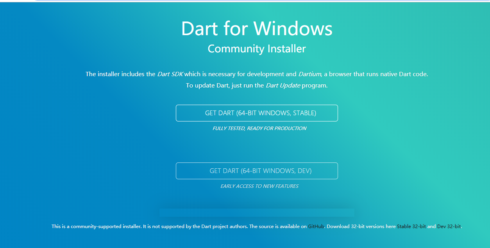

# FLUTTER入门

## flutter 开发环境搭建

###  获取flutter SDK

这里不推荐在官网下载，原因是由于网络及下载速度的关系，推荐直接使用git下载，方式如下：

```none
git clone https://github.com/flutter/flutter.git
```

### 配置flutter环境变量


打开cmd，输入flutter，会列出flutter所有的命令列表。
为了可以顺利切换版本与升级，可以设置两个用户变量：

**变量名PUB_HOSTED_URL，变量值https://pub.flutter-io.cn。** <br/>
**变量名FLUTTER_STORAGE_BASE_URL，变量值https://storage.flutter-io.cn。**


### 检测flutter环境

在cmd中运行命令：

```
flutter doctor
```

会自动检查flutter运行环境，并显示结果。


**注意：**

有的小伙伴刚开始接触flutter会有很多疑惑，比如刚刚运行flutter doctor 后，发现doctor summary后面有好多 “！”，不知道这是怎么回事的小伙伴儿，图中第一个 “！” 表示的是本机没有安装 安卓的licenses ，运行后面的

```
flutter doctor --android-licenses
```

就可以喽！

### 升级flutter

在cmd中运行命令：

```
flutter upgrade
```


至此flutter SDK的环境就搭建好啦！

## Android Studio/VScode安装flutter插件

### Android Studio/IDEA

**安装flutter插件：**

file -> settings -> plugins 


**安装dart插件：**

file -> settings -> plugins 


**注意事项**

需要下载Dart SDK ,用于编译dart文件；下载地址为 <https://gekorm.com/dart-windows/>



安装完成后，找到dart安装目录（默认是`C:\Program Files\Dart\`）下面的`dart-sdk`下面的`bin`目录加到Path环境变量即可！