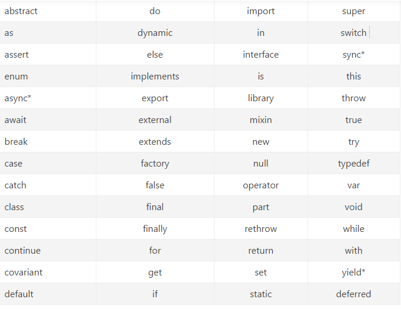

# FLUTTER基础篇

## dart 简介

```
Dart是谷歌开发的计算机编程语言，后来被Ecma (ECMA-408)认定为标准。它被用于web、服务器、移动应用和物联网等领域的开发。它是宽松开源许可证（修改的BSD证书）下的开源软件。Dart是面向对象的、类定义的、单继承的语言
```

## 语言特性

- Dart所有的东西都是对象， 即使是数字numbers、函数function、null也都是对象，所有的对象都继承自Object类。

- Dart动态类型语言, 尽量给变量定义一个类型，会更安全，没有显示定义类型的变量在 debug 模式下会类型会是 dynamic(动态的)。

- Dart 在 running 之前解析你的所有代码，指定数据类型和编译时的常量，可以提高运行速度。

- Dart中的类和接口是统一的，类即接口，你可以继承一个类，也可以实现一个类（接口），自然也包含了良好的面向对象和并发编程的支持。

- Dart 提供了顶级函数(如：main())。

- Dart 没有 public、private、protected 这些关键字，变量名以"_"开头意味着对它的 lib 是私有的。

- 没有初始化的变量都会被赋予默认值 null。

- final的值只能被设定一次。const 是一个编译时的常量，可以通过 const 来创建常量值，var c=const[];，这里 c 还是一个变量，只是被赋值了一个常量值，它还是可以赋其它值。实例变量可以是 final，但不能是  const。

## 关键字



## 变量与常量

**1.变量声明与初始化**

- 调用的变量name包含对String值为“张三” 的对象的引用，name推断变量的类型是String，但可以通过指定它来更改该类型，如果对象不限于单一类型（没有明确的类型），请使用Object或dynamic关键字。

```dart
 // 没有明确类型，编译的时候根据值明确类型
  var name = ‘Bob’; 
  Object name = '张三';
  dynamic name = '李四';
 // 显示声明将被推断类型, 可以使用String显示声明字符串类型
  String name = 'Bob' ;
```

**2.默认值**

- 未初始化的变量的初始值为null（包括数字）

```dart
  //测试
  int lineCount;
  // 为false的时候抛出异常
  assert(lineCount == null);
  print(lineCount); //打印结果为null
```

**3.**final and const

- 一个 final 变量只能被初始化一次; const变量是一个编译时常量，(Const变量是隐式的final)
  final的顶级或类变量在第一次使用时被初始化。
- 被final修饰的顶级变量或类变量在第一次声明的时候就需要初始化。

```dart
final String outSideFinalName;
// The final variable 'outSideFinalName' must be initialized.
```

- 被final或者const修饰的变量，变量类型可以省略，建议指定数据类型。

```dart
//可以省略String这个类型声明
 final name = "Lhw";
 final String name1  = "张三";
 
 const name2 = "abc1";
 const String name3 = "李四";
```

- 被 final 或 const 修饰的变量无法再去修改其值。

```dart
 final String name = "Alex";
 // name', a final variable, can only be set once
 // 一个final变量，只能被设置一次。
 name = "Bill";
 
 const String userName = 'Bill';
 // 这样写，编译器提示：Constant variables can't be assigned a value
 // const常量不能赋值
 // userName = "小黄";
```

- flnal 或者 const 不能和 var 同时使用

- 常量如果是全局变量，请使用 static const

```dart
 // 常量如果是全局变量
 static const String name3 = 'Tom';
```

- 在常量表达式中，该运算符的操作数必须为'bool'、'num'、'String'或'null', const常量必须用conat类型的值初始化。

```dart
const String outSideName = 'Bill';
const String outSideName2 = 'Tom';
const String outSideConstName = 'Joy';

const validConstString = '$outSideName $outSideName2 $outSideConstName';
```

## 数据类型

**1.num**

- **num** 是数字类型的父类，有两个子类 int 和 double。

- **int** 根据平台的不同，整数值不大于64位。在Dart VM上，值可以从-263到263 - 1，编译成JavaScript的Dart使用JavaScript代码，允许值从-253到253 - 1。

- **double** 64位（双精度）浮点数，如IEEE 754标准所规定。

```dart
int a = 1;
 print(a);
 
 double b = 1.12;
 print(b);
 
 // String -> int
 int one = int.parse('1');
 // 输出3
 print(one + 2);
 
 // String -> double
 var onePointOne = double.parse('1.1');
 // 输出3.1
 print(onePointOne + 2);

 // int -> String
 String oneAsString = 1.toString();
 // The argument type 'int' can't be assigned to the parameter type 'String'
 //print(oneAsString + 2);
 // 输出 1 + 2
 print('$oneAsString + 2');
 // 输出 1 2
 print('$oneAsString 2');

 // double -> String 注意括号中要有小数点位数，否则报错
 String piAsString = 3.14159.toStringAsFixed(2);
 // 截取两位小数, 输出3.14
 print(piAsString);
 
 String aString = 1.12618.toStringAsFixed(2);
 // 检查是否四舍五入，输出1.13，发现会做四舍五入
 print(aString);
```

**2.String**

- 可以使用单引号或双引号来创建一个字符串。

- 单引号或者双引号里面嵌套使用引号。

```dart
 String singleString = 'abcdddd';
 String doubleString = "abcsdfafd";
 
 String sdString = '$singleString a "bcsd" ${singleString}';
 String dsString = "abc 'aaa' $sdString";
 print(sdString);
 print(dsString);


 String singleString = 'aaa';
 String doubleString = "bbb";
 // 单引号嵌套双引号
 String sdString = '$singleString a "bbb" ${doubleString}';
 // 输出 aaa a "bbb" bbb
 print(sdString);
 
 // 双引号嵌套单引号
 String dsString = "${singleString.toUpperCase()} abc 'aaa' $doubleString.toUpperCase()";
 // 输出 AAA abc 'aaa' bbb.toUpperCase(), 
 // ”$doubleString.toUpperCase()“ 没有加“{}“，导致输出结果是”bbb.toUpperCase()“
 print(dsString);
```

**3.bool**

- Dart 是强 bool 类型检查，只有bool 类型的值是true 才被认为是true。

- 只有两个对象具有bool类型：true和false，它们都是编译时常量。

**4.List集合**

- 在Dart中，数组是List对象。

```dart
 //创建一个int类型的list
 List list = [10, 7, 23];
 // 输出[10, 7, 23]
 print(list);
 
 // 使用List的构造函数，也可以添加int参数，表示List固定长度，不能进行添加 删除操作
 var fruits = new List();
 
 // 添加元素
 fruits.add('apples');
 
 // 添加多个元素
 fruits.addAll(['oranges', 'bananas']);
 
 List subFruits = ['apples', 'oranges', 'banans'];
 // 添加多个元素
 fruits.addAll(subFruits);
 
 // 输出： [apples, oranges, bananas, apples, oranges, banans]
 print(fruits);
 
 // 获取List的长度
 print(fruits.length);
 
 // 获取第一个元素
 print(fruits.first);
 
 // 获取元素最后一个元素
 print(fruits.last);
 
 // 利用索引获取元素
 print(fruits[0]);
 
 // 查找某个元素的索引号
 print(fruits.indexOf('apples'));
 
 // 删除指定位置的元素，返回删除的元素
 print(fruits.removeAt(0));

 // 删除指定元素,成功返回true，失败返回false
 // 如果集合里面有多个“apples”, 只会删除集合中第一个改元素
 fruits.remove('apples');

 // 删除最后一个元素，返回删除的元素
 fruits.removeLast();

 // 删除指定范围(索引)元素，含头不含尾
 fruits.removeRange(start,end);

 // 删除指定条件的元素(这里是元素长度大于6)
 fruits.removeWhere((item) => item.length >6)；

 // 删除所有的元素
 fruits.clear();

```

- 注意事项：

1. 可以直接打印list包括list的元素，list也是一个对象。但是java必须遍历才能打印list，直接打印是地址值。
2. 和java一样list里面的元素必须保持类型一致，不一致就会报错。
3. 和java一样list的角标从0开始。
4. 如果集合里面有多个相同的元素“X”, 只会删除集合中第一个改元素。

**5.Map集合**

- 直接声明，用{}表示，里面写key和value，每组键值对中间用逗号隔开。

```dart
 Map companys = {'Alibaba': '阿里巴巴', 'Tencent': '腾讯', 'baidu': '百度'};
 // 输出：{Alibaba: 阿里巴巴, Tencent: 腾讯, baidu: 百度}
 print(companys);
```

- 先声明，再去赋值。

```dart
 Map schoolsMap = new Map();
 schoolsMap['first'] = '清华';
 schoolsMap['second'] = '北大';
 schoolsMap['third'] = '复旦';
 // 打印结果 {first: 清华, second: 北大, third: 复旦}
 print(schoolsMap);
```

- API

```dart
// 指定键值对的参数类型
var aMap = new Map<int, String>();

// Map的赋值，中括号中是Key，这里可不是数组
aMap[1] = '小米';

//Map中的键值对是唯一的
//同Set不同，第二次输入的Key如果存在，Value会覆盖之前的数据
aMap[1] = 'alibaba';

// map里面的value可以相同
aMap[2] = 'alibaba';

// map里面value可以为空字符串
aMap[3] = '';

// map里面的value可以为null
aMap[4] = null;

print(aMap);

// 检索Map是否含有某Key
assert(aMap.containsKey(1));

//删除某个键值对
aMap.remove(1); 

print(aMap);  
```

